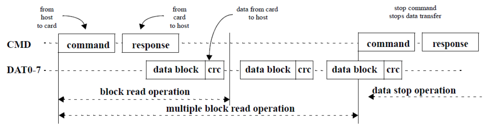
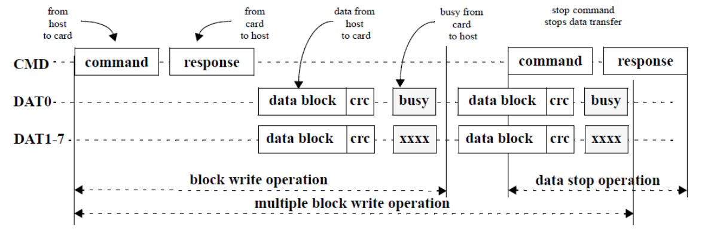

# eMMC 简介

eMMC 是 embedded MultiMediaCard 的简称。MultiMediaCard，即 MMC， 是一种闪存卡（Flash Memory Card）标准，它定义了 MMC 的架构以及访问　Flash Memory 的接口和协议。而 eMMC 则是对 MMC 的一个拓展，以满足更高标准的性能、成本、体积、稳定、易用等的需求。

eMMC 的整体架构如图片 1 所示：

  
**图片 1： eMMC 整体架构**

eMMC 内部主要可以分为 Flash Memory、Flash Controller 以及 Host Interface 三大部分，后续的章节将会对这三个部分进行详细介绍。

## 1. Flash Memory

Flash Memory 是一种非易失性的存储器，通常在嵌入式系统中用于存放系统、应用和数据等，类似与 PC 系统中的硬盘。

### 1.1 Flash Memory 的主要特性

与传统的硬盘相比，Flash Memory 具有质量轻、能耗低、体积小、抗震能力强等的优点，但也有不少局限性，主要如下：

1. 需要先擦除再写入  
  Flash Memory 写入数据时有一定的限制。它只能将当前为 1 的比特改写为 0，而无法将已经为 0 的比特改写为 1，只有在擦除的操作中，才能把整块的比特改写为 1。

2. 块擦除次数有限  
  Flash Memory 的每个数据块都有擦除次数的限制（十万到百万次不等），擦写超过一定次数后，该数据块将无法可靠存储数据，成为坏块。

  为了最大化的延长 Flash Memory 的寿命，在软件上需要做擦写均衡（Wear Leveling），通过分散写入、动态映射等手段均衡使用各个数据块。同时，软件还需要进行坏块管理（Bad Block Management，BBM），识别和标识坏块，不让坏块参与数据存储。（注：除了擦写导致的坏块外，Flash Memory 在生产过程也会产生坏块，即固有坏块。）

3. 读写干扰  
  由于硬件实现上的物理特性，Flash Memory 在进行读写操作时，有可能会导致邻近的其他比特发生位翻转，导致数据异常。这种异常可以通过重新擦除来恢复。Flash Memory 通常会使用 ECC 等算法进行错误检测和数据修正。

5. 电荷泄漏  
  存储在 Flash Memory 存储单元的电荷，如果长期没有使用，会发生电荷泄漏，导致数据错误。不过这个时间比较长，一般十年左右。此种异常是非永久性的，重新擦除可以恢复。

### 1.2 Flash Memory 类型

根据硬件物理实现上的不同，Flash Memory 主要可以分为 NOR Flash 和 NAND Flash 两类，主要的差异如下所示：

* NAND Flash 读取速度与 NOR Flash 相近，根据接口的不同有所差异；
* NAND Flash 的写入速度比 NOR Flash 快很多；
* NAND Flash 的擦出速度比 NOR Flash 快很多；
* NAND Flash 最大擦出次数比 NOR Flash 多；
* NOR Flash 支持片上执行，可以在上面直接运行代码；
* NOR Flash 软件驱动比 NAND Flash 简单；
* NOR Flash 可以随机按字节读取数据，NAND Flash 需要按块进行读取。
* 大容量下 NAND Flash 比 NOR Flash 成本要低很多，体积也更小；

（注：擦除 NOR Flash 时是以 64～128KB 的块进行的，执行一个写入 / 擦除操作的时间为 5s，擦除 NAND Flash 是以 8～32KB 的块进行的，执行相同的操作最多只需要 4ms。）

#### 1.2.1 NOR Flash

NOR Flash 根据与 CPU 端接口的不同，可以分为 Parallel NOR Flash 和 Serial NOR Flash 两类。
Parallel NOR Flash 可以接入到 Host 的 SRAM/DRAM Controller 上，支持片上执行。Serial NOR Flash 的成本比 Parallel NOR Flash 低，主要通过 SPI 接口与 Host 连接。

  
**图片 2： Parallel NOR Flash 与 Serial NOR Flash**

鉴于 NOR Flash 擦写速度慢，成本高等特性，NOR Flash 主要应用于小容量、内容更新少的场景，例如 PC 主板 BIOS、路由器系统存储等。

#### 1.2.2 NAND Flash

NAND Flash 根据每个存储单元内存储比特个数的不同，可以分为 SLC（Single-Level Cell）、MLC（Multi-Level Cell） 和 TLC（Triple-Level Cell） 三类。其中，在一个存储单元中，SLC 可以存储 1 个比特，MLC 可以存储 2 个比特，TLC 则可以存储 3 个比特。

NAND Flash 的一个存储单元内部，是通过不同的电压等级，来表示其所存储的信息的。在 SLC 中，存储单元的电压被分为两个等级，分别表示 0 和 1 两个状态，即 1 个比特。在 MLC 中，存储单元的电压则被分为 4 个等级，分别表示 00 01 10 11 四个状态，即 2 个比特位。同理，在 TLC 中，存储单元的电压被分为 8 个等级，存储 3 个比特信息。

  
**图片 3： SLC、MLC 与 TLC**

NAND Flash 的单个存储单元存储的比特位越多，读写性能会越差，寿命也越短，但是成本会更低。Table 1 中，给出了特定工艺和技术水平下的成本和寿命数据。

**Table 1**  

|| SLC | MLC | TLC |
| -- | -- | -- | -- |
| 制造成本 | 30-35 美元 / 32GB | 17 美元 / 32GB | 9-12 美元 / 32GB |
| 擦写次数 | 10万次或更高 | 1万次或更高 | 5000次甚至更高 |
| 存储单元 | 1 bit / cell | 2 bits / cell | 3 bits / cell |
（注：以上数据来源于互联网，仅供参考）

相比于 NOR Flash，NAND Flash 写入性能好，大容量下成本低。目前，绝大部分手机和平板等移动设备中所使用的 eMMC 内部的 Flash Memory 都属于 NAND Flash。PC 中的固态硬盘中也是使用 NAND Flash。

### 1.3 eMMC 内部 Flash Memory 的分区 

eMMC 在内部对 Flash Memory 划分了几个区域，如下图所示：

  
**图片 4：eMMC 内部分区**

1. BOOT Area Partition 1 & 2  
  此分区主要是为了支持从 eMMC 启动系统而设计的。  
  该分区的数据，在 eMMC 上电后，可以通过很简单的协议就可以读取出来。同时，大部分的 SOC 都可以通过 GPIO 或者 FUSE 的配置，让 ROM 代码在上电后，将 eMMC BOOT 分区的内容加载到 SOC 内部的 SRAM 中执行。
  
2. RPMB Partition  
  RPMB 是 Replay Protected Memory Block 的简称，它通过 RSA 和 Write Counter 来保证保存在 RPMB 内部的数据不被非法篡改。  
  在实际应用中，RPMB 分区通常用来保存安全相关的数据，例如指纹数据、安全支付相关的密钥等。

3. User Data Area Partition  
  此分区则主要用于存储系统和用户数据。
  
## 2. Flash Controller

由于 NAND Flash 存在的多种局限，eMMC 在其内部集成了 Flash Controller，用于完成擦写均衡、坏块管理、ECC校验等功能。相比于直接将 NAND Flash 接入到 Host 端，可以减少 Host 端软件的复杂度，让 Host 端专注于上层业务，省去对 NAND Flash 进行特殊的处理。

  
**图片 5：NAND Flash 与 eMMC**

在某些 eMMC 中，Flash Controller 还会完成一些特殊的工作。例如，一个 16GB 的 TLC eMMC，在出厂后， 先让内部的 NAND Flash 处于 SLC 状态，这样可以在初期获得较好的性能。当达到一定条件后（eg. 使用了总存储容量的 1/3 时），Flash Controller 将 NAND Flash 切换到 TLC 状态，以确保能够达到标称的数据存储容量。这种 NAND Flash 状态的切换，由 Flash Controller 进行，对于 Host 来说，是完全透明的。

## 3. Host Interface

eMMC 与 Host 之间的连接如下图所示：

  
**图片 6：eMMC Interface**

各个信号的用途如下所示：

**CLK**  
用于同步的时钟信号

**Data Strobe**  
此信号是从 Device 端输出的时钟信号，频率和 CLK 信号相同，用于同步从 Device 端输出的数据。该信号在 eMMC 5.0 中引入。

**CMD**  
此信号用于发送 Host 的 command 和 Device 的 response。

**DAT0-7**  
用于传输数据的 8 bit 总线。

Host 与 eMMC 之间的通信都是 Host 以一个 Command 开始发起的。针对不同的 Command，Device 会做出不同的响应。下面图片是 Host 进行 Multiple-block read/write 的时序图。更多详细的协议细节请参考 eMMC 5.1 协议标准[12]。

**Multiple Block Read**

**Multiple Block Write**

## 4. 参考资料

1. [NOR NAND Flash Guide: Selecting a Flash Storage Solution](https://www.micron.com/~/media/documents/products/product-flyer/flyer_nor_nand_flash_guide.pdf) [PDF]  
2. [Wiki: Common Flash Memory Interface](https://en.wikipedia.org/wiki/Common_Flash_Memory_Interface) [Web]  
3. [Quick Guide to Common Flash Interface](https://www.spansion.com/Support/Application%20Notes/Quick_Guide_to_CFI_AN.pdf) [PDF]  
4. [MICRON NOR Flash Technology](https://www.micron.com/products/nor-flash) [Web]  
5. [MICRON NAND Flash Technology](https://www.micron.com/products/nand-flash) [Web]  
6. [Wiki：闪存](https://zh.wikipedia.org/wiki/%E9%97%AA%E5%AD%98) [Web]  
7. [Wiki：Flash File System](https://en.wikipedia.org/wiki/Flash_file_system) [Web]  
8. [Wear Leveling in Micron® NAND Flash Memory](https://www.micron.com/~/media/documents/products/technical-note/nand-flash/tn2961_wear_leveling_in_nand.pdf) [PDF]  
9. [Understanding Flash: The Flash Translation Layer](https://flashdba.com/2014/09/17/understanding-flash-the-flash-translation-layer/) [Web]
10. [谈NAND Flash的底层结构和解析](http://blog.sina.com.cn/s/blog_4b4b54da01016rx3.html) [Web]  
11. [闪存基础](http://www.ssdfans.com/?p=45) [Web]  
12. [Embedded Multi-Media Card (e•MMC) Electrical Standard (5.1)](http://www.jedec.org/sites/default/files/docs/JESD84-B51.pdf)  [PDF]  
