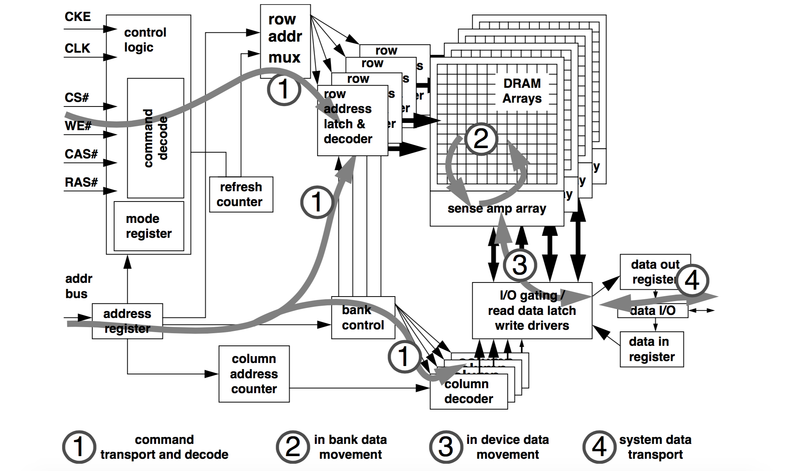
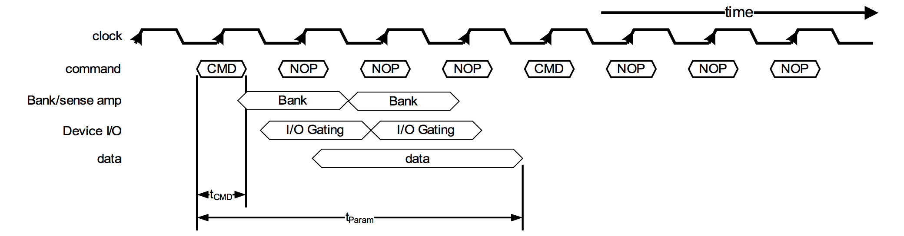
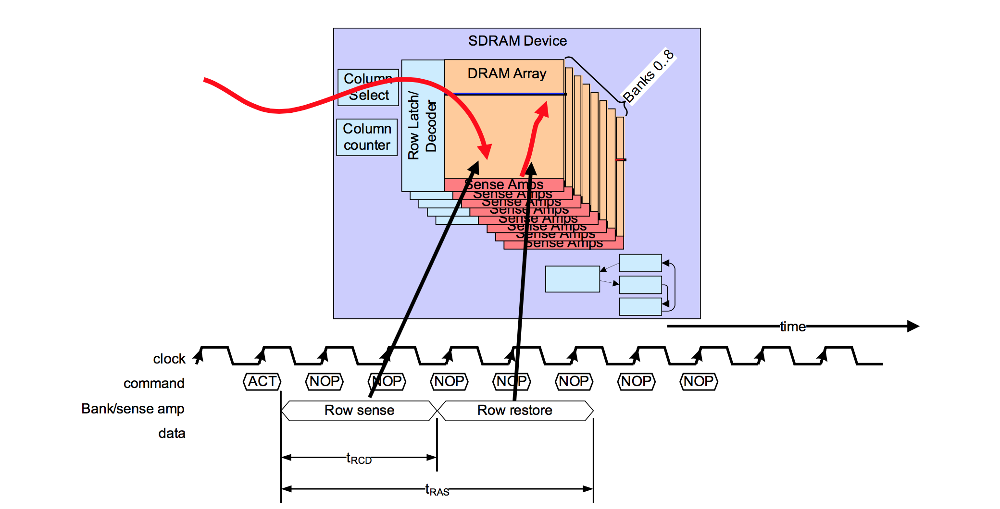
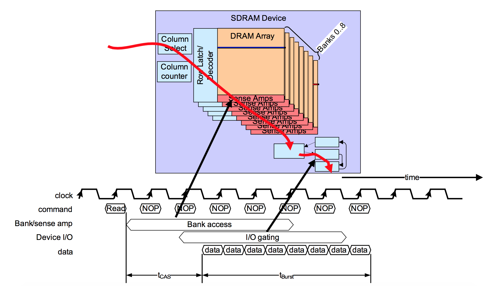
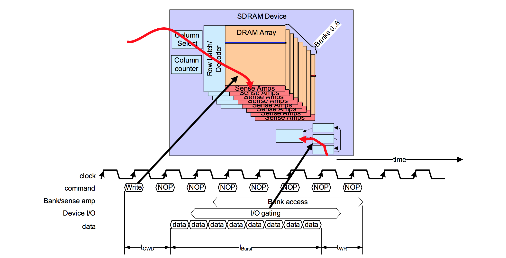
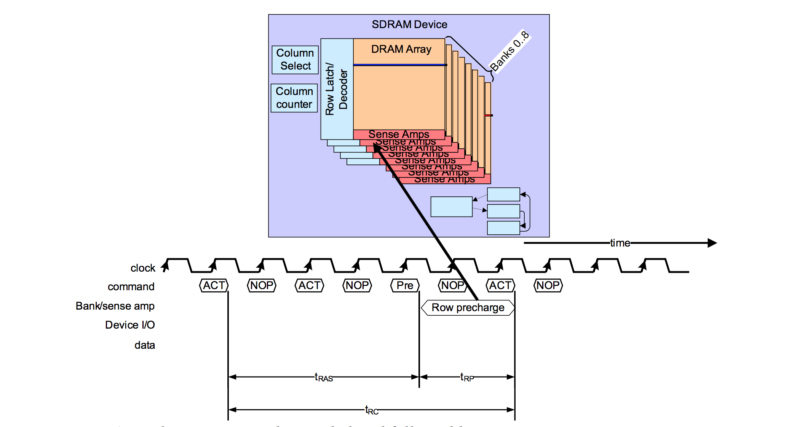
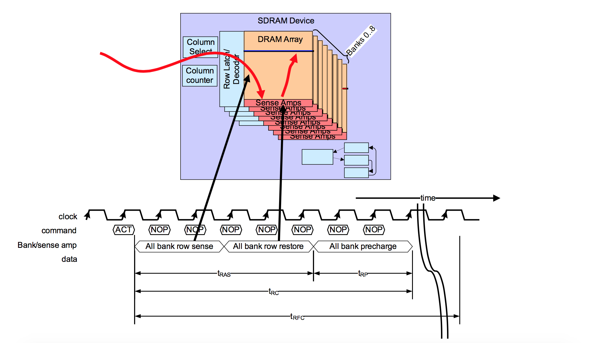
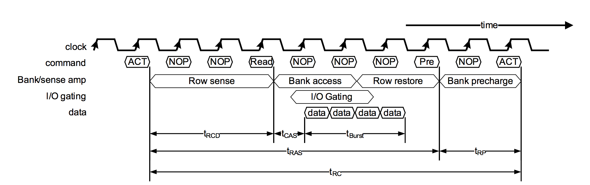

# DRAM Timing

在 DRAM Device 章节中，我们简单介绍了 SDRAM 的 Active、Read、Write 等的操作，在本章节中，我们将详细的介绍各个操作的时序。

## Overview

如上图所示，SDRAM 的相关操作在内部大概可以分为以下的几个阶段：

1. Command transport and decode

    在这个阶段，Host 端会通过 Command Bus 和 Address Bus 将具体的 Command 以及相应参数传递给 SDRAM。SDRAM 接收并解析 Command，接着驱动内部模块进行相应的操作。

2. In bank data movement

    在这个阶段，SDRAM 主要是将 Memory Array 中的数据从 DRAM Cells 中读出到 Sense Amplifiers，或者将数据从 Sense Amplifiers 写入到 DRAM Cells。
 
3. In device data movement

    这个阶段中，数据将通过 IO 电路缓存到 Read Latchs 或者通过 IO 电路和 Write Drivers 更新到 Sense Amplifiers。

4. System data transport

    在这个阶段，进行读数据操作时，SDRAM 会将数据输出到数据总线上，进行写数据操作时，则是 Host 端的 Controller 将数据输出到总线上。

在上述的四个阶段中，每个阶段都会有一定的耗时，例如数据从 DRAM Cells 搬运到 Read Latchs 的操作需要一定的时间，因此在一个具体的操作需要按照一定时序进行。  
同时，由于内部的一些部件可能会被多个操作使用，例如读数据和写数据都需要用到部分 IO 电路，因此多个不同的操作通常不能同时进行，也需要遵守一定的时序。  
此外，某些操作会消耗很大的电流，为了满足 SDRAM 设计上的功耗指标，可能会限制某一些操作的执行频率。

基于上面的几点限制，SDRAM Controller 在发出 Command 时，需要遵守一定的时序和规则，这些时序和规则由相应的 SDRAM 标准定义。在后续的章节中，我们将对各个 Command 的时序进行详细的介绍。

## 时序图例

TODO：时序图例（需要描述各个部分的含义）

上图中，Clock 信号是由 SDRAM Controller 发出的，用于和 DRAM 之间的同步。在 DDRx 中，Clock 信号是一组差分信号，在本文中为了简化描述，将只画出其中的 Positive Clock。

Controller 与 DRAM 之间的交互，都是以 Controller 发起一个 Command 开始的。从 Controller 发出一个 Command 到 DRAM 接收并解析该 Command 所需要的时间定义为 tCMD，不同类型的 Command 的 tCMD 都是相同的。

DRAM 在成功解析 Command 后，就会根据 Command 在内部进行相应的操作。从 Controller 发出 Command 到 DRAM 执行完 Command 所对应的操作所需要的时间定义为 tParam。不同类型的 Command 的 tParam 可能不一样，相同 Command 的 tParam 由于 Command 参数的不同也可能会不一样。

> NOTE: 
> 各种 Command 的定义和内部操作细节可以参考前面的几个章节，本章节中将主要关注时序方面的细节。

## Row Active Command

在进行数据的读写前，Controller 需要先发送 Row Active Command，打开 DRAM Memory Array 中的指定的 Row。Row Active Command 的时序如下图所示：

Row Active Command 可以分为两个阶段：

### Row Sense

Row Active Command 通过地址总线指明需要打开某一个 Bank 的某一个 Row。  
DRAM 在接收到该 Command 后，会打开该 Row 的 Wordline，将其存储的数据读取到 Sense Amplifiers 中，这一时间定义为 tRCD（RCD for Row Address to Column Address Delay）。  
DRAM 在完成 Row Sense 阶段后，Controller 就可以发送 Read 或 Write Command 进行数据的读写了。这也意味着，Controller 在发送 Row Active Command 后，需要等待 tRCD 时间才能接着发送 Read 或者 Write Command 进行数据的读写。  

### Row Restore

由于 DRAM 的特性，Row 中的数据在被读取到 Sense Amplifiers 后，需要进行 Restore 的操作（细节请参考 [DRAM Storage Cell](./dram_storage_cell.html) 章节）。Restore 操作可以和数据的读取同时进行，即在这个阶段，Controller 可能发送了 Read Command 进行数据读取。  
DRAM 接收到 Row Active Command 到完成 Row Restore 操作所需要的时间定义为 tRAS（RAS for Row Address Strobe）。  
Controller 在发出一个 Row Active Command 后，必须要等待 tRAS 时间后，才可以发起另一次的 Precharge 和 Row Access。

## Column Read Command

Controller 发送 Row Active Command 并等待 tRCD 时间后，再发送 Column Read Command 进行数据读取。  
Column Read Command 的时序如下图所示：

Column Read Command 通过地址总线 A[0:9] 指明需要读取的 Column 的起始地址。DRAM 在接收到该 Command 后，会将数据从 Sense Amplifiers 中通过 IO 电路搬运到数据总线上。  
DRAM 从接收到 Command 到第一组数据从数据总线上输出的时间称为 tCAS（CAS for Column Address Strobe），也称为 tCL（CL for CAS Latency），这一时间可以通过 mode register 进行配置，通常为 3~5 个时钟周期。  

DRAM 在接收到 Column Read Command 的 tCAS 时间后，会通过数据总线，将 n 个 Column 的数据逐个发送给 Controller，其中 n 由 mode register 中的 burst length 决定，通常可以将 burst length 设定为 2、4 或者 8。

开始发送第一个 Column 数据，到最后一个 Column 数据的时间定义为 tBurst。

## Column Write Command

Controller 发送 Row Active Command 并等待 tRCD 时间后，再发送 Column Write Command 进行数据写入。 
Column Write Command 的时序如下图所示：

Column Write Command 通过地址总线 A[0:9] 指明需要写入数据的 Column 的起始地址。Controller 在发送完 Write Command 后，需要等待 tCWD （CWD for Column Write Delay） 时间后，才可以发送待写入的数据。tCWD 在一些描述中也称为 tCWL（CWL for Column Write Latency）

tCWD 在不同类型的 SDRAM 标准有所不同：

| Memory Type | tCWD |
| -- | -- |
| SDRAM | 0 cycles |
| DDR SDRAM | 1 cycle |
| DDR2 SDRAM | tCAS - 1 cycle |
| DDR3 SDRAM | programmable |

DRAM 接收完数据后，需要一定的时间将数据写入到 DRAM Cells 中，这个时间定义为 tWR（WR for Write Recovery）。

## Precharge Command

在 [DRAM Storage Cell](./dram_storage_cell.html) 章节中，我们了解到，要访问 DRAM Cell 中的数据，需要先进行 Precharge 操作。相应地，在 Controller 发送 Row Active Command 访问一个具体的 Row 前， Controller 需要发送 Precharge Command 对该 Row 所在的 Bank 进行 Precharge 操作。

下面的时序图描述了 Controller 访问一个 Row 后，执行 Precharge，然后再访问另一个 Row 的流程。

DRAM 执行 Precharge Command 所需要的时间定义为 tRP（RP for Row Precharge）。Controller 在发送一个 Row Active Command 后，需要等待 tRC（RC for Row Cycle）时间后，才能发送第二个 Row Active Command 进行另一个 Row 的访问。

从时序图上我们可以看到，tRC = tRAS + tRP，tRC 时间决定了访问 DRAM 不同 Row 的性能。在实际的产品中，通常会通过降低 tRC 耗时或者在一个 Row Cycle 执行尽可能多数据读写等方式来优化性能。

> NOTE：  
> 在一个 Row Cycle 中，发送 Row Active Command 打开一个 Row 后，Controller 可以发起多个 Read 或者 Write Command 进行一个 Row 内的数据访问。这种情况下，由于不用进行 Row 切换，数据访问的性能会比需要切换 Row 的情况好。  
> 在一些产品上，DRAM Controller 会利用这一特性，对 CPU 发起的内存访问进行调度，在不影响数据有效性的情况下，将同一个 Row 上的数据访问汇聚到一直起执行，以提供整体访问性能。

## Row Refresh Command

一般情况下，为了保证 DRAM 数据的有效性，Controller 每隔 tREFI（REFI for Refresh Interval） 时间就需要发送一个 Row Refresh Command 给 DRAM，进行 Row 刷新操作。DRAM 在接收到 Row Refresh Command 后，会根据内部 Refresh Counter 的值，对所有 Bank 的一个或者多个 Row 进行刷新操作。

DRAM 刷新的操作与 Active + Precharge Command 组合类似，差别在于 Refresh Command 是对 DRAM 所有 Bank 同时进行操作的。下图为 DRAM Row Refresh Command 的时序图：

DRAM 完成刷新操作所需的时间定义为 tRFC（RFC for Refresh Cycle）。  

tRFC 包含两个部分的时间，一是完成刷新操作所需要的时间，由于 DRAM Refresh 是同时对所有 Bank 进行的，刷新操作会比单个 Row 的 Active + Precharge 操作需要更长的时间；tRFC 的另一部分时间则是为了降低平均功耗而引入的延时，DRAM Refresh 操作所消耗的电流会比单个 Row 的 Active + Precharge 操作要大的多，tRFC 中引入额外的时延可以限制 Refresh 操作的频率。

> NOTE:  
> 在 DDR3 SDRAM 上，tRFC 最小的值大概为 110ns，tRC 则为 52.5ns。

## Read Cycle

一个完整的 Read Cycle 如下图所示：

## Read Command With Auto Precharge

DRAM 还可以支持 Auto Precharge 机制。在 Read Command 中的地址线 A10 设为 1 时，就可以触发 Auto Precharge。此时 DRAM 会在完成 Read Command 后的合适的时机，在内部自动执行 Precharge 操作。

Read Command With Auto Precharge 的时序如下图所示： 

Auto Precharge 机制的引入，可以降低 Controller 实现的复杂度，进而在功耗和性能上带来改善。

> NOTE:  
> Write Command 也支持 Auto Precharge 机制，参考下一小节的时序图。

## Additive Latency

在 DDR2 中，又引入了 Additive Latency 机制，即 AL。通过 AL 机制，Controller 可以在发送完 Active Command 后紧接着就发送 Read 或者 Write Command，而后 DRAM 会在合适的时机（延时 tAL 时间）执行 Read 或者 Write Command。时序如下图所示：

TODO：AL Read timing
TODO：AL Write timing

Additive Latency 机制同样是降低了 Controller 实现的复杂度，在功耗和性能上带来改善。

## DRAM Timing 设定

## 参考资料

1. Memory Systems - Cache Dram and Disk
2. [timings explication](http://www.tweakers.fr/timings.html)

