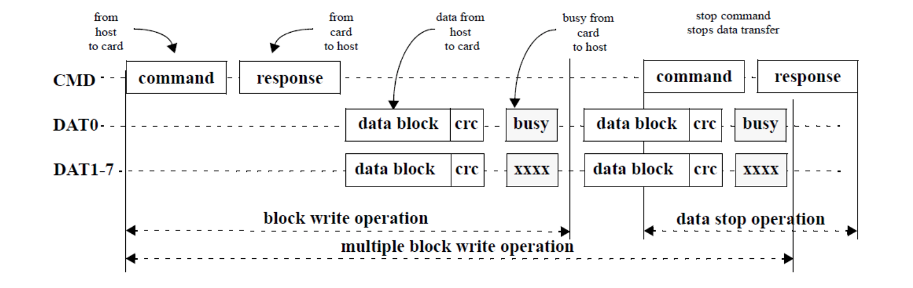

# eMMC 总线协议

## eMMC 总线接口

eMMC 总线接口定义如下图所示：  

  

各个信号的描述如下：

**CLK**  

CLK 信号用于从 Host 端输出时钟信号，进行数据传输的同步和设备运作的驱动。  
在一个时钟周期内，CMD 和 DAT0-7 信号上都可以支持传输 1 个比特，即 SDR (Single Data Rate) 模式。此外，DAT0-7 信号还支持配置为 DDR (Double Data Rate) 模式，在一个时钟周期内，可以传输 2 个比特。  
Host 可以在通讯过程中动态调整时钟信号的频率（注，频率范围需要满足 Spec 的定义）。通过调整时钟频率，可以实现省电或者数据流控（避免 Over-run 或者 Under-run）功能。
在一些场景中，Host 端还可以关闭时钟，例如 eMMC 处于 Busy 状态时，或者接收完数据，进入 Programming State 时。

**CMD**  

CMD 信号主要用于 Host 向 eMMC 发送 Command 和 eMMC 向 Host 发送对于的 Response。Command 和 Response 的细节会在后续章节中介绍。

**DAT0-7**  

DAT0-7 信号主要用于 Host 和 eMMC 之间的数据传输。在 eMMC 上电或者软复位后，只有 DAT0 可以进行数据传输，完成初始化后，可配置 DAT0-3 或者 DAT0-7 进行数据传输，即数据总线可以配置为 4 bits 或者 8 bits 模式。（疑问：为什么提供这两种模式？什么情况下用不同的模式？）

**Data Strobe**  

Data Strobe 时钟信号由 eMMC 发送给 Host，频率与 CLK 信号相同，用于 Host 端进行数据接收的同步。Data Strobe 信号只能在 HS400 模式下配置启用，启用后可以提高数据传输的稳定性，省去总线 tuning 过程。

## eMMC 总线模型

TODO: Add Pic

如上图所示，eMMC 总线中，可以有一个 Host，多个 eMMC Devices。总线上的所有通讯都由 Host 端以一个 Command 开发发起，Host 一次只能与一个 eMMC Device 通讯。

系统在上电启动后，Host 会为所有 eMMC Device 逐个分配地址（RCA，Relative device Address）。当 Host 需要和某一个 eMMC Device 通讯时，会先根据 RCA 选中该 eMMC Device，只有被选中的 eMMC Device 才会响应 Host 的 Command。

> NOTE:  
> 更详细的工作原理请参考 [eMMC 工作模式](/emmc_modes.html) 章节。

### 速率模式

随着 eMMC 协议的版本迭代，eMMC 总线的速率越来越高。为了兼容旧版本的 eMMC Device，所有 Devices 在上电启动或者 Reset 后，都会先进入兼容速率模式（Backward Compatible Mode）。在完成 eMMC Devices 的初始化后，Host 可以通过特定的流程，让 Device 进入其他高速率模式，目前支持以下的几种速率模式。

| Mode | Data Rate  | Bus Width | Frequency | Max Data Transfer (x8) |
| -- | --  | -- | -- | -- |
| Backward Compatible | Single  | x1, x4, x8 | 0-26 MHz | 26 MB/s |
| High Speed SDR | Single  | x1, x4, x8 | 0-52 MHz | 52 MB/s |
| High Speed DDR | Dual | x4, x8 | 0-52 MHz | 104 MB/s |
| HS200 | Single | x4, x8 | 0-200 MHz | 200 MB/s |
| HS400 | Dual | x8 | 0-200 MHz | 400 MB/s |

### 通信模型

Host 与 eMMC Device 之间的通信都是由 Host 以一个 Command 开始发起的，eMMC Device 在完成 Command 所指定的任务后，则返回一个 Response。

#### Read Data

Host 从 eMMC Device 读取数据的流程如上图所示。  

如果 Host 发送的是 Single Block Read 的 Command，那么 eMMC Device 只会发送一个 Block 的数据（一个 Block 的数据的字节数由 Host 设定或者为 eMMC Device 的默认值，更多细节请参考 [eMMC 工作模式](/emmc_modes.html) 章节）。  
如果 Host 发送的是 Multiple Block Read 的 Command，那么 eMMC Device 会持续发送数据，直到 Host 主动发送 Stop Command。

#### Write Data

Host 向 eMMC Device 写入数据的流程如上图所示。  

如果 Host 发送的是 Single Block Write Command，那么 eMMC Device 只会将后续第一个 Block 的数据写入的存储器中。  
如果 Host 发送的是 Multiple Block Write Command，那么 eMMC Device 会持续地将接收到的数据写入到存储器中，直到 Host 主动发送 Stop Command。  
当 eMMC Device 正在将数据写入到内部存储器时，eMMC Device 会将 DAT0 信号拉低，作为 Busy 信号。Host 会持续检测 DAT0 信号，直到为高电平时，才会接着发送下一个 Block 的数据。  

#### No Data

在 Host 与 eMMC Device 的通信中，有部分交互是不需要进行数据传输的，还有部分交互甚至不需要 eMMC Device 的回复 Response。

#### Command

TODO: Add Pic

如上图所示，eMMC Command 由 48 Bits 组成，各个 Bits 的解析如下所示：

 
 
 47 46 [45:40] [39:8] [7:1] 0
 1 1 6 32 7 1
“0” “1” x x x “1”

| Description | Start Bit  | Transmission Bit | Command Index | Argument | CRC7 | End Bit |
| -- | --  | -- | -- | -- | -- | -- |
| Bit position | Single  | x1, x4, x8 | 0-26 MHz | 26 MB/s |
| Width (bits) | Single  | x1, x4, x8 | 0-26 MHz | 26 MB/s |
| Value  | Single  | x1, x4, x8 | 0-26 MHz | 26 MB/s |

#### Response

#### Data Block

## eMMC 总线测试过程

## eMMC 总线 Tuning

需要描述的内容：

1. Pin 定义
2. 总线通讯模型，基于消息的命令和响应模型
3. 寻址方式，设备操作方式
4. 总线模式，兼容模式、高速模式、HS200 模式、HS400 模式
5. 命令、响应、数据传输的详细格式
6. 总线的测试和 tuning

