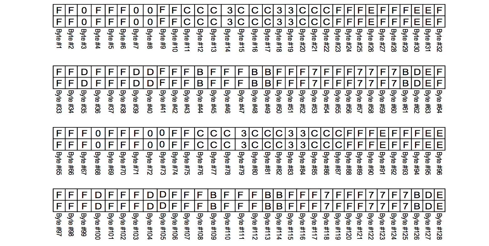

# eMMC 总线协议

## eMMC 总线接口

eMMC 总线接口定义如下图所示：  

  

各个信号的描述如下：

**CLK**  

CLK 信号用于从 Host 端输出时钟信号，进行数据传输的同步和设备运作的驱动。  
在一个时钟周期内，CMD 和 DAT0-7 信号上都可以支持传输 1 个比特，即 SDR (Single Data Rate) 模式。此外，DAT0-7 信号还支持配置为 DDR (Double Data Rate) 模式，在一个时钟周期内，可以传输 2 个比特。  
Host 可以在通讯过程中动态调整时钟信号的频率（注，频率范围需要满足 Spec 的定义）。通过调整时钟频率，可以实现省电或者数据流控（避免 Over-run 或者 Under-run）功能。
在一些场景中，Host 端还可以关闭时钟，例如 eMMC 处于 Busy 状态时，或者接收完数据，进入 Programming State 时。

**CMD**  

CMD 信号主要用于 Host 向 eMMC 发送 Command 和 eMMC 向 Host 发送对于的 Response。Command 和 Response 的细节会在后续章节中介绍。

**DAT0-7**  

DAT0-7 信号主要用于 Host 和 eMMC 之间的数据传输。在 eMMC 上电或者软复位后，只有 DAT0 可以进行数据传输，完成初始化后，可配置 DAT0-3 或者 DAT0-7 进行数据传输，即数据总线可以配置为 4 bits 或者 8 bits 模式。

**Data Strobe**  

Data Strobe 时钟信号由 eMMC 发送给 Host，频率与 CLK 信号相同，用于 Host 端进行数据接收的同步。Data Strobe 信号只能在 HS400 模式下配置启用，启用后可以提高数据传输的稳定性，省去总线 tuning 过程。

> **NOTE:**  
> Extended CSD byte[183] BUS_WIDTH 寄存器用于配置总线宽度和 Data Strobe 

## eMMC 总线模型

eMMC 总线中，可以有一个 Host，多个 eMMC Devices。总线上的所有通讯都由 Host 端以一个 Command 开发发起，Host 一次只能与一个 eMMC Device 通讯。

系统在上电启动后，Host 会为所有 eMMC Device 逐个分配地址（RCA，Relative device Address）。当 Host 需要和某一个 eMMC Device 通讯时，会先根据 RCA 选中该 eMMC Device，只有被选中的 eMMC Device 才会响应 Host 的 Command。

> NOTE:  
> 更详细的工作原理请参考 [eMMC 工作模式](./emmc_modes.html) 章节。

### 速率模式

随着 eMMC 协议的版本迭代，eMMC 总线的速率越来越高。为了兼容旧版本的 eMMC Device，所有 Devices 在上电启动或者 Reset 后，都会先进入兼容速率模式（Backward Compatible Mode）。在完成 eMMC Devices 的初始化后，Host 可以通过特定的流程，让 Device 进入其他高速率模式，目前支持以下的几种速率模式。

| Mode | Data Rate  | Bus Width | Frequency | Max Data Transfer (x8) |
| -- | --  | -- | -- | -- |
| Backward Compatible | Single  | x1, x4, x8 | 0-26 MHz | 26 MB/s |
| High Speed SDR | Single  | x1, x4, x8 | 0-52 MHz | 52 MB/s |
| High Speed DDR | Dual | x4, x8 | 0-52 MHz | 104 MB/s |
| HS200 | Single | x4, x8 | 0-200 MHz | 200 MB/s |
| HS400 | Dual | x8 | 0-200 MHz | 400 MB/s |

> **NOTE:**  
> Extended CSD byte[185] HS_TIMING 寄存器可以配置总线速率模式  
> Extended CSD byte[183] BUS_WIDTH 寄存器用于配置总线宽度和 Data Strobe 

### 通信模型

Host 与 eMMC Device 之间的通信都是由 Host 以一个 Command 开始发起的，eMMC Device 在完成 Command 所指定的任务后，则返回一个 Response。

#### Read Data

Host 从 eMMC Device 读取数据的流程如上图所示。  

如果 Host 发送的是 Single Block Read 的 Command，那么 eMMC Device 只会发送一个 Block 的数据（一个 Block 的数据的字节数由 Host 设定或者为 eMMC Device 的默认值，更多细节请参考 [eMMC 工作模式](./emmc_modes.html) 章节）。  
如果 Host 发送的是 Multiple Block Read 的 Command，那么 eMMC Device 会持续发送数据，直到 Host 主动发送 Stop Command。

> **NOTE:**  
> 从 eMMC Device 读数据都是按 Block 读取的。

#### Write Data

Host 向 eMMC Device 写入数据的流程如上图所示。  

如果 Host 发送的是 Single Block Write Command，那么 eMMC Device 只会将后续第一个 Block 的数据写入的存储器中。  
如果 Host 发送的是 Multiple Block Write Command，那么 eMMC Device 会持续地将接收到的数据写入到存储器中，直到 Host 主动发送 Stop Command。  

eMMC Device 在接收到一个 Block 的数据后，会进行 CRC 校验，然后将校验结果通过 CRC Token 发送给 Host。  
发送完 CRC Token 后，如果 CRC 校验成功，eMMC Device 会将数据写入到内部存储器时，此时 DAT0 信号会拉低，作为 Busy 信号。Host 会持续检测 DAT0 信号，直到为高电平时，才会接着发送下一个 Block 的数据。如果 CRC 校验失败，那么 eMMC Device 不会进行数据写入，此次传输后续的数据都会被忽略。

> **NOTE:**  
> 向 eMMC Device 写数据都是按 Block 写入的。

#### No Data

在 Host 与 eMMC Device 的通信中，有部分交互是不需要进行数据传输的，还有部分交互甚至不需要 eMMC Device 的回复 Response。

#### Command

如上图所示，eMMC Command 由 48 Bits 组成，各个 Bits 的解析如下所示：

| Description | Start Bit  | Transmission Bit | Command Index | Argument | CRC7 | End Bit |
| -- | --  | -- | -- | -- | -- | -- |
| Bit position | 47 | 46 | [45:40] | [39:8] | [7:1] | 0 |
| Width (bits) | 1 | 1 | 6 | 32 | 7 | 1 |
| Value | "0" | "1" | x | x | x | "1" |

Start Bit 固定为 "0"，在没有数据传输的情况下，CMD 信号保持高电平，当 Host 将 Start Bit 发送到总线上时，eMMC Device 可以很方便检测到该信号，并开始接收 Command。

Transmission Bit 固定为 "1"，指示了该数据包的传输方向为 Host 发送到 eMMC Device。

Command Index 和 Argument 为 Command 的具体内容，不同的 Command 有不同的 Index，不同的 Command 也有各自的 Argument。 更多的细节，请参考 [eMMC Commands](./emmc_commands.html) 章节。

CRC7 是包含 Start Bit、Transmission Bit、 Command Index 和 Argument 内容的 CRC 校验值。

End Bit 为结束标志位，固定为"1"。 

> **NOTE:**  
> CRC 校验简单来说，是发送方将需要传输的数据“除于”（模2除）一个约定的数，并将得到的余数附在数据上一并发送出去。接收方收到数据后，再做同样的“除法”，然后校验得到余数是否与接收的余数相同。如果不相同，那么意味着数据在传输过程中发生了改变。更多的细节不在本文展开描述，感兴趣的读者可以参考 [CRC wiki](https://en.wikipedia.org/wiki/Cyclic_redundancy_check) 中的介绍。

#### Response

eMMC Response 有两种长度的数据包，分别为 48 Bits 和 136 Bits。

Start Bit 与 Command 一样，固定为 "0"，在没有数据传输的情况下，CMD 信号保持高电平，当 eMMC Device 将 Start Bit 发送到总线上时，Host 可以很方便检测到该信号，并开始接收 Response。

Transmission Bit 固定为 "0"，指示了该数据包的传输方向为 eMMC Device 发送到 Host。

Content 为 Response 的具体内容，不同的 Command 会有不同的 Content。 更多的细节，请参考 [eMMC Responses](./emmc_responses.html) 章节。

CRC7 是包含 Start Bit、Transmission Bit 和 Content 内容的 CRC 校验值。

End Bit 为结束标志位，固定为"1"。 

#### Data Block

Data Block 由 Start Bit、Data、CRC16 和 End Bit 组成。以下是不同总线宽度和 Data Rate 下，Data Block 详细格式。

**1 Bit Bus SDR**  

CRC 为 Data 的 16 bit CRC 校验值，不包含 Start Bit。

**4 Bits Bus SDR**  

各个 Data Line 上的 CRC 为对应 Data Line 的 Data 的 16 bit CRC 校验值。

**8 Bits Bus SDR**  

各个 Data Line 上的 CRC 为对应 Data Line 的 Data 的16 bit CRC 校验值。

**4 Bits Bus DDR**  

**8 Bits Bus DDR**  

在 DDR 模式下，Data Line 在时钟的上升沿和下降沿都会传输数据，其中上升沿传输数据的奇数字节 （Byte 1,3,5 ...），下降沿则传输数据的偶数字节（Byte 2,4,6 ...）。  
此外，在 DDR 模式下，1 个 Data Line 上有两个相互交织的 CRC16，上升沿的 CRC 比特组成 odd CRC16，下降沿的 CRC 比特组成 even CRC16。odd CRC16 用于校验该 Data Line 上所有上升沿比特组成的数据，even CRC16 则用于校验该 Data Line 上所有下降沿比特组成的数据。

> **NOTE:**  
> DDR 模式下使用两个 CRC16 作为校验，可能是为了更可靠的校验，选用 CRC16 而非 CRC32 则可能是出于兼容性设计的考虑。

#### CRC Status Token 

在写数据传输中，eMMC Device 接收到 Host 发送的一个 Data Block 后，会进行 CRC 校验，如果校验成功，eMMC 会在对应的 Data Line 上向 Host 发回一个 Positive CRC status token (010)，如果校验失败，则会在对应的 Data Line 上发送一个 Negative CRC status token (101)。  

> **NOTE:**  
> 读数据时，Host 接收到 eMMC Device 发送的 Data Block 后，也会进行 CRC 校验，但是不管校验成功或者失败，都不会向 eMMC Device 发送 CRC Status Token。

详细格式如下图所示：

**Positive CRC status token**  

**Negative CRC status token**  

## eMMC 总线测试过程

当 eMMC Device 处于 SDR 模式时，Host 可以发送 CMD19 命令，触发总线测试过程（Bus testing procedure），测试总线硬件上的连通性。如果 eMMC Device 支持总线测试，那么 eMMC Device 在接收到 CMD19 后，会发回对应的 Response，接着 eMMC Device 会发送一组固定的测试数据给 Host。Host 接收到数据后，检查数据正确与否，即可得知总线是否正确连通。

> **NOTE:** 
> 如果 eMMC Device 不支持总线测试，那么接收到 CMD19 时，不会发回 Response。  
> 总线测试不支持在 DDR 模式下进行。  

测试数据如下所示：

> **NOTE:** 
> 总线宽度为 1 时，只发送 DAT0 上的数据，总线宽度为 4 时，则只发送 DAT0-3 上的数据

## eMMC 总线 Sampling Tuning

由于芯片制造工艺、PCB 走线、电压、温度等因素的影响，数据信号从 eMMC Device 到达 Host 端的时间是存在差异的，Host 接收数据时采样的时间点也需要相应的进行调整。而 Host 端最佳采样时间点，则是通过 Sampling Tuning 流程得到。  

> **NOTE:**  
> 不同 eMMC Device 最佳的采样点可能不同，同一 eMMC Device 在不同的环境下运作时的最佳采样点也可能不同。  
> 在 eMMC 标准中，定义了在 HS200 模式下可以进行 Sampling Tuning。

### Sampling Tuning 流程

Sampling Tuning 是用于计算 Host 最佳采样时间点的流程，大致的流程如下：

1. Host 将采样时间点重置为默认值
2. Host 向 eMMC Device 发送 Send Tuning Block 命令
3. eMMC Device 向 Host 发送固定的 Tuning Block 数据
4. Host 接收到 Tuning Block 并进行校验
5. Host 修改采样时点，重新从第 2 步开始执行，直到 Host 获取到一个有效采样时间点区间
6. Host 取有效采样时间点区间的中间值作为采样时间点，并推出 Tuning 流程
 
> **NOTE:**  
> 上述流程仅仅是一个示例。Tuning 流程执行的时机、频率和具体的步骤是由 Host 端的 eMMC Controller 具体实现而定的。

### Tuning Block 数据

Tuning Block 是专门为了 Tuning 而设计的一组特殊数据。相对于普通的数据，这组特殊数据在传输过程中，会更高概率的出现 high SSO noise、deterministic jitter、ISI、timing errors 等问题。这组数据的具体内容如下所示：

> **NOTE:** 
> 总线宽度为 1 时，只发送 DAT0 上的数据，总线宽度为 4 时，则只发送 DAT0-3 上的数据

## 参考资料

1. [Embedded Multi-Media Card (e•MMC) Electrical Standard (5.1)](http://www.jedec.org/sites/default/files/docs/JESD84-B51.pdf)  [PDF]  
2. [SD/MMC Controller, Hard Processor System (HPS) Technical Reference Manual (TRM)](http://citeseerx.ist.psu.edu/viewdoc/download?doi=10.1.1.296.5338&rep=rep1&type=pdf) [PDF]
3. [CRC wiki](https://en.wikipedia.org/wiki/Cyclic_redundancy_check) [WEB]

