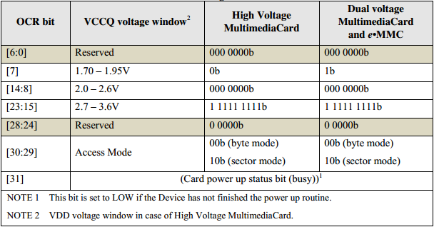
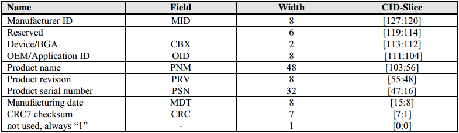
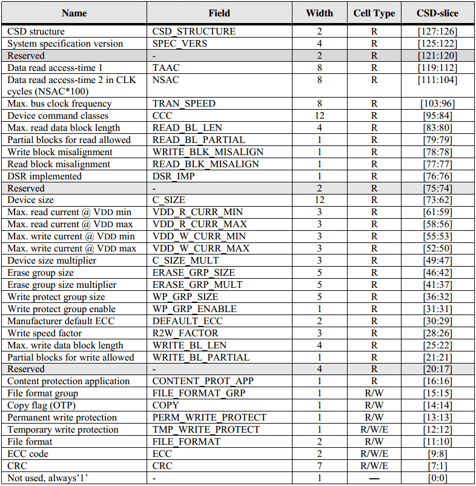

# eMMC 设备寄存器

## OCR register

OCR，即 Operation Conditions Register，此寄存器包含 eMMC Device 支持的电压模式、数据寻址模式（按 Byte 寻址 or 按 Sector 寻址）以及 Busy 标志位。

 

此寄存器的值，会在 Device Identification Mode 中，作为 CMD1 的响应内容返回给 Host。

> **NOTE: **  
> Voltage Window 指明 eMMC Device 支持 1.70v - 1.95v 和 2.7v - 3.6v 两个工作电压范围。
> 容量小于等于 2 GB 的 eMMC Devcie 的 Access Mode 为 Byte Mode，容量大于 2 GB 的 eMMC Devcie 的 Access Mode 为 Sector Mode。

## CID register

 

### MID [127:120]

MID is an 8 bit binary number that identifies the device manufacturer. The MID number is controlled, defined and allocated to an e•MMC manufacturer by JEDEC. This procedure is established to ensure uniqueness of the CID register.

### CBX [113:112]

CBX indicates the device type.

| [113:112] | Type  |
| -- | --  |
| 00 | Device (removable) |
| 01 | BGA (Discrete embedded) |
| 10 | POP |
| 11 | Reserved |

### OID [111:104]

OID is an 8-bit binary number that identifies the Device OEM and/or the Device contents (when used as a distribution media either on ROM or FLASH Devices). The OID number is controlled, defined and allocated to an e•MMC manufacturer by JEDEC. This procedure is established to ensure uniqueness of the CID register

### PNM [103:56]

The product name, PNM, is a string, 6 ASCII characters long.

### PRV [55:48]

The product revision, PRV, is composed of two Binary Coded Decimal (BCD) digits, four bits each, representing an “n.m” revision number. The “n” is the most significant nibble and “m” is the least significant nibble. As an example, the PRV binary value field for product revision “6.2” will be: 0110 0010.

### PSN [47:16]

PSN is a 32-bit unsigned binary integer.

### MDT [15:8]

The manufacturing date, MDT, is composed of two hexadecimal digits, four bits each, representing a two digits date code m/y; The “m” field, most significant nibble, is the month code. 1 = January. The “y” field, least significant nibble, is the year code. 0 = 1997. As an example, the binary value of the MDT field for production date “April 2000” will be: 0100 0011

### CRC [7:1]

The CRC7 checksum (7 bits). This is the checksum of the CID contents computed according to 0.

## CSD register

The Device-Specific Data (CSD) register provides information on how to access the Device contents. The CSD defines the data format, error correction type, maximum data access time, data transfer speed, whether the DSR register can be used etc. The programmable part of the register (entries marked by W or E below) can be changed by CMD27. The type of the CSD Registry entries below is coded as follows:

**R**: Read only.  
**W**: One time programmable and not readable.  
**R/W**: One time programmable and readable.  
**W/E**: Multiple writable with value kept after power failure, H/W reset assertion and any CMD0 reset and not readable.  
**R/W/E**: Multiple writable with value kept after power failure, H/W reset assertion and any CMD0 reset and readable.  
**R/W/C_P**: Writable after value cleared by power failure and HW/rest assertion (the value not cleared by CMD0 reset) and readable.  
**R/W/E_P**: Multiple writable with value reset after power failure, H/W reset assertion and any CMD0 reset and readable.  
**W/E_P**: Multiple writable with value reset after power failure, H/W reset assertion and any CMD0 reset and not readable.  

 

> **NOTE:**  
> 更多 CSD Register 的细节请参考 eMMC Spec.