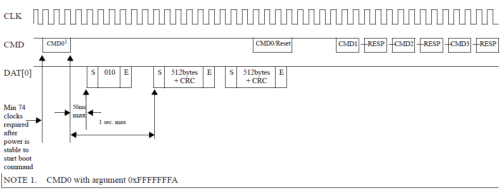

# eMMC 分区管理

## Partitions Overview

eMMC 标准中，将内部的 Flash Memory 划分为 4 类区域，最多可以支持 8 个硬件分区，如下图所示：

### 概述
一般情况下，Boot Area Partitions 和 RPMB Partition 的容量大小通常都为 4MB，部分芯片厂家也会提供配置的机会。General Purpose Partitions (GPP) 则在出厂时默认不被支持，即不存在这些分区，需要用户主动使能，并配置其所要使用的 GPP 的容量大小，GPP 的数量可以为 1 - 4 个，各个 GPP 的容量大小可以不一样。User Data Area (UDA) 的容量大小则为总容量大小减去其他分区所占用的容量。更多各个分区的细节将在后续章节中描述。

### 分区编址
eMMC 的每一个硬件分区的存储空间都是独立编址的，即访问地址为 0 - partition size。具体的数据读写操作实际访问哪一个硬件分区，是由 eMMC 的 Extended CSD register 的 PARTITION_CONFIG Field 中 的 Bit[2:0]: PARTITION_ACCESS 决定的，用户可以通过配置 PARTITION_ACCESS 来切换硬件分区的访问。也就是说，用户在访问特定的分区前，需要先发送命令，配置 PARTITION_ACCESS，然后再发送相关的数据访问请求。更多数据读写相关的细节，请参考 [eMMC 总线协议](./emmc_bus_protocol.html) 章节。

eMMC 的各个硬件分区有其自身的功能特性，多分区的设计，为不同的应用场景提供了便利。

## Boot Area Partitions

Boot Area 包含两个 Boot Area Partitions，主要用于存储 Bootloader，支持 SOC 从 eMMC 启动系统。

### 容量大小
两个 Boot Area Partitions 的大小是完全一致的，由 Extended CSD register 的 BOOT_SIZE_MULT Field 决定，大小的计算公式如下： 

  **Size = 128Kbytes x BOOT_SIZE_MULT**  
  
一般情况下，Boot Area Partition 的大小都为 4 MB，即 BOOT_SIZE_MULT 为 32，部分芯片厂家会提供改写 BOOT_SIZE_MULT 的功能来改变 Boot Area Partition 的容量大小。BOOT_SIZE_MULT 最大可以为 255，即 Boot Area Partition 的最大容量大小可以为 255 x 128 KB = 32640 KB = 31.875 MB。

### 从 Boot Area 启动
eMMC 中定义了 Boot State，在 Power-up、HW reset 或者 SW reset 后，如果满足一定的条件，eMMC 就会进入该 State。进入 Boot State 的条件如下：

**Original Boot Operation**  
CMD 信号保持低电平不少于 74 个时钟周期，会触发 Original Boot Operation，进入 Boot State。

**Alternative Boot Operation**  
在 74 个时钟周期后，在 CMD 信号首次拉低或者 Host 发送 CMD1 之前，Host 发送参数为 0xFFFFFFFA 的 COM0时，会触发 Alternative Boot Operation，进入 Boot State。

在 Boot State 下，如果有配置 BOOT_ACK，eMMC 会先发送 “010” 的 ACK 包，接着 eMMC 会将最大为 128Kbytes x BOOT_SIZE_MULT 的 Boot Data 发送给 Host。传输过程中，Host 可以通过拉高 CMD 信号 (Original Boot 中)，或者发送 Reset 命令 (Alternative Boot 中) 来中断 eMMC 的数据发送，完成 Boot Data 传输。

Boot Data 根据 Extended CSD register 的 PARTITION_CONFIG Field 的 Bit[5:3]:BOOT_PARTITION_ENABLE 的设定，可以从 Boot Area Partition 1、Boot Area Partition 2 或者 User Data Area 
读出。  

> Boot Data 存储在 Boot Area 比在 User Data Area 中要更加的安全，可以减少意外修改导致系统无法启动，同时无法更新系统的情况出现。  

（更多 Boot State 的细节，请参考 [eMMC 总线协议](./emmc_bus_prolocol) 的 Boot State 章节）

### 写保护
通过设定 Extended CSD register 的 BOOT_WP Field，可以为两个 Boot Area Partition 独立配置写保护功能,以防止数据被意外改写或者擦出。

eMMC 中定义了两种 Boot Area 的写保护模式：

1. Power-on write protection，使能后，如果 eMMC 掉电，写保护功能失效，需要每次 Power on 后进行配置
2. Permanent write protection，使能后，即使掉电也不会失效，主动进行关闭才会失效

## RPMB Partition
RPMB（Replay Protected Memory Block）Partition 是 eMMC 中的一个具有安全特性的分区。  
eMMC 在写入数据到 RPMB 时，会校验数据的合法性，只有指定的 Host 才能够写入，同时在读数据时，也提供了签名机制，保证 Host 读取到的数据是 RPMB 内部数据，而不是攻击者伪造的数据。

RPMB 在实际应用中，通常用于存储一些有防止非法篡改需求的数据，例如手机上指纹支付相关的公钥、序列号等。RPMB 可以对写入操作进行鉴权，但是读取并不需要鉴权，任何人都可以进行读取的操作，因此存储到 RPMB 的数据通常会进行加密后再存储。

### 容量大小
两个 RPMB Partition 的大小是由 Extended CSD register 的 BOOT_SIZE_MULT Field 决定，大小的计算公式如下：  
  
  **Size = 128Kbytes x BOOT_SIZE_MULT**  
  
一般情况下，Boot Area Partition 的大小为 4 MB，即 RPMB_SIZE_MULT 为 32，部分芯片厂家会提供改写 RPMB_SIZE_MULT 的功能来改变 RPMB Partition 的容量大小。RPMB_SIZE_MULT 最大可以为 128，即 Boot Area Partition 的最大容量大小可以为 128 x 128 KB = 16384 KB = 16 MB。

### Replay Protect 原理

使用 eMMC 的产品，在产线生产时，会为每一个产品生产一个唯一的 256 bits 的 Secure Key，烧写到 eMMC 的 OTP 区域（只能烧写一次的区域），同时 Host 在安全区域中（例如：TEE）也会保留该 Secure Key。

在 eMMC 内部，还有一个RPMB Write Counter。RPMB 每进行一次合法的写入操作时，Write Counter 就会自动加一 。

通过 Secure Key 和 Write Counter 的应用，RMPB 可以实现数据读取和写入的 Replay Protect。

#### RPMB 数据读取

RPMB 数据读取的流程如下：

1. Host 向 eMMC 发起读 RPMB 的请求，同时生成一个 16 bytes 的随机数，发送给 eMMC。
2. eMMC 将请求的数据从 RPMB 中读出，并使用 Secure Key 通过 HMAC SHA-256 算法，计算读取到的数据和接收到的随机数拼接到一起后的签名。然后，eMMC 将读取到的数据、接收到的随机数、计算得到的签名一并发送给 Host。
3. Host 接收到 RPMB 的数据、随机数以及签名后，首先比较随机数是否与自己发送的一致，如果一致，再用同样的 Secure Key 通过 HMAC SHA-256 算法对数据和随机数组合到一起进行签名，如果签名与 eMMC 发送的签名是一致的，那么就可以确定该数据是从 RPMB 中读取到的正确数据，而不是攻击者伪造的数据。

通过上述的读取流程，可以保证 Host 正确的读取到 RPMB 的数据。

#### RPMB 数据写入

RPMB 数据写入的流程如下：

1. Host 按照上面的读数据流程，读取 RPMB 的 Write Counter。
2. Host 将需要写入的数据和 Write Counter 拼接到一起并计算签名，然后将数据、Write Counter 以及签名一并发给 eMMC。
3. eMMC 接收到数据后，先对比 Write Counter 是否与当前的值相同，如果相同那么再对数据和 Write Counter 的组合进行签名，然后和 Host 发送过来的签名进行比较，如果签名相同则鉴权通过，将数据写入到 RPMB 中。

通过上述的写入流程，可以保证 RPMB 不会被非法篡改。

更多 RPMB 相关的细节，可以参考 [eMMC RPMB](./emmc_rpmb.html) 章节。

## General Purpose Partitions

eMMC 提供了 General Purpose Partitions (GPP)，主要用于存储系统和应用数据。在很多使用 eMMC 的产品中，GPP 都没有被启用，因为它在功能上与 UDA 类似，产品上直接使用 UDA 就可以满足需求。

### 容量大小
eMMC 最多可以支持 4 个 GPPs，每一个 GPP 的大小可以单独配置。用户可以通过设定 Extended CSD register 的以下三个 Field 来设 GPPx (x=1~4) 的容量大小：

* GP_SIZE_MULT_x_2
* GP_SIZE_MULT_x_1
* GP_SIZE_MULT_x_0

GPPx 的容量计算公式如下：

Size = (GP_SIZE_MULT_x_2 \* 2^16 + GP_SIZE_MULT_x_1 \* 2^8 + GP_SIZE_MULT_x_0 \* 2^0) \*
       (Write protect group size)

Write protect group size = 512KB \* HC_ERASE_GRP_SIZE \* HC_WP_GRP_SIZE

> * eMMC 中，擦除和写保护都是按块进行的，上述表达式中的 HC_WP_GRP_SIZE 为写保护的操作块大小，HC_ERASE_GRP_SIZE 则为擦除操作的快的大小。
> * eMMC 芯片的 GPP 的配置通常是只能进行一次 (OTP)，一般会在产品量产阶段，在产线上进行。

### 分区属性

eMMC 标准中，为 GPP 定义了两类属性，Enhanced attribute 和 Extended attribute。每个 GPP 可以设定两类属性中的一种属性，不可以同时设定多个属性。

**Enhanced attribute**  

- Default, 未设定 Enhanced attribute。
- Enhanced storage media， 设定 GPP 为 Enhanced storage media。

在 eMMC 标准中，实际上并未定义设定 Enhanced attribute 后对 eMMC 的影响。Enhanced attribute 的具体作用，由芯片制造商定义。  
在实际的产品中，设定 Enhanced storage media 后，一般是把该分区的存储介质从 MLC 改变为 SLC，提高该分区的读写性能、寿命以及稳定性。由于 1 个存储单元下，MLC 的容量是 SLC 的两倍，所以在总的存储单元数量一定的情况下，如果把原本为 MLC 的分区改变为 SLC，会减少 eMMC 的容量，就是说，此时 eMMC 的实际总容量比标称的总容量会小一点。（MLC 和 SLC 的细节可以参考 [Flash Memory](../index.html) 章节内容）

**Extended attribute**  

- Default, 未设定 Extended attribute。
- System code， 设定 GPP 为 System code 属性，该属性主要用在存放操作系统类的、很少进行擦写更新的分区。
- Non-Persistent，设定 GPP 为 Non-Persistent 属性，该属性主要用于存储临时数据的分区，例如 tmp 目录所在分区、 swap 分区等。

在 eMMC 标准中，同样也没有定义设定 Extended attribute 后对 eMMC 的影响。Extended attribute 的具体作用，由芯片制造商定义。Extended attribute 主要是跟分区的应用场景有关，厂商可以为不用应用场景的分区做不同的优化处理。

## User Data Area

User Data Area (UDA) 通常是 eMMC 中最大的一个分区，是实际产品中，最主要的存储区域。

### 容量大小
UDA 的容量大小不需要设置，在配置完其他分区大小后，再扣除设置 Enhanced attribute 所损耗的容量，剩下的容量就是 UDA 的容量。

### 软件分区
为了更合理的管理数据，满足不同的应用需求，UDA 在实际产品中，会进行软件再分区。目前主流的软件分区技术有 MBR（Master Boot Record）和 GPT（GUID Partition Table）两种。这两种分区技术的基本原理类似，如下图所示：

软件分区技术一般是将存储介质划分为多个区域，既 SW Partitions，然后通过一个 Partition Table 来维护这些 SW Partitions。在 Partition Table 中，每一个条目都保存着一个 SW Partition 的起始地址、大小等的属性信息。软件系统在启动后，会去扫描 Partition Table，获取存储介质上的各个 SW Partitions 信息，然后根据这些信息，将各个 Partitions 加载到系统中，进行数据存取。

> MBR 和 GPT 此处不展开详细介绍，更多的细节可以参考 wikipedia 上 [MBR](https://en.wikipedia.org/wiki/Master_boot_record) 和 [GPT](https://en.wikipedia.org/wiki/GUID_Partition_Table) 相关介绍。

### 区域属性
eMMC 标准中，支持为 UDA 中一个特定大小的区域设定 Enhanced attribute。与 GPP 中的 Enhanced attribute 相同，eMMC 标准也没有定义该区域设定 Enhanced attribute 后对 eMMC 的影响。Enhanced attribute 的具体作用，由芯片制造商定义。  

**Enhanced attribute**  

- Default, 未设定 Enhanced attribute。
- Enhanced storage media， 设定该区域为 Enhanced storage media。

在实际的产品中，UDA 区域设定为 Enhanced storage media 后，一般是把该区域的存储介质从 MLC 改变为 SLC。通常，产品中可以将某一个 SW Partition 设定为 Enhanced storage media，以获得更好的性能和健壮性。

## eMMC 分区应用实例

## 参考资料

1. [Embedded Multi-Media Card (e•MMC) Electrical Standard (5.1)](http://www.jedec.org/sites/default/files/docs/JESD84-B51.pdf)  [PDF]  
2. [Disk partitioning](https://en.wikipedia.org/wiki/Disk_partitioning) [Web]
3. [Master Boot Record](https://en.wikipedia.org/wiki/Master_boot_record) [Web]
4. [GUID Partition Table](https://en.wikipedia.org/wiki/GUID_Partition_Table) [Web]
